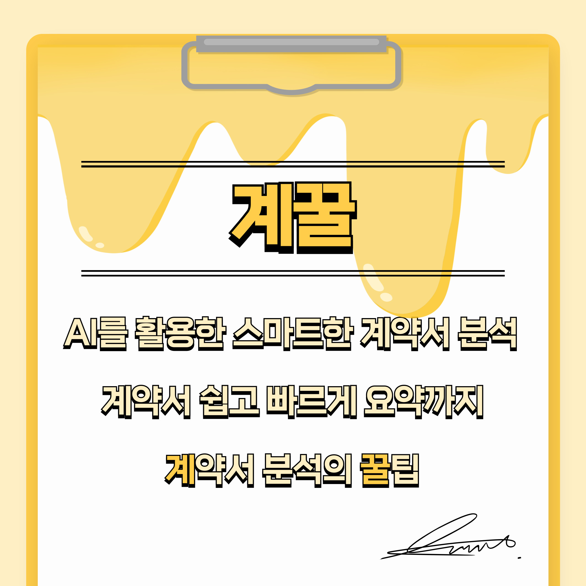
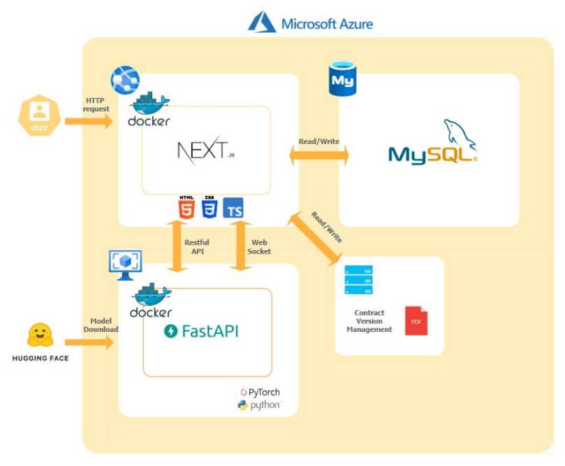

<h1> 계약서 분석 AI 어시스턴트 <계꿀></h1>

> **KT AIVLE School 6기 27조 빅프로젝트**  
> AI를 활용한 계약서 내용 요약 및 위법/독소조항 식별  
> 계약서 버전 별 관리 및 법령/표준계약서 자료실 제공  

## One-page manual

## Project Overview

## System Architecture

## Contributors

<table align="center">
  <tr>
    <th style="text-align:center"> </th>
    <th style="text-align:center">전재엽</th>
    <th style="text-align:center">백미소</th>
    <th style="text-align:center">이종환</th>
    <th style="text-align:center">박광훈</th>
    
  </tr>
  <tr>
    <td></td>
    <td align="center"></td>
    <td align="center"></td>
    <td align="center"></td>
    <td align="center"></td>
  </tr>
  <tr>
    <td><strong>역할</strong></td>
    <td align="center"><strong>PM / FS Dev</strong></td>
    <td align="center"><strong>FS Dev</strong></td>
    <td align="center"><strong>FS Dev</strong></td>
    <td align="center"><strong>FS Dev</strong></td>
  </tr>
  <tr>
    <td><strong>주요 업무</strong></td>
    <td align="center">
      - WEB팀 일정 및 업무 할당  
      - 계약서 분석 결과화면 / 버전 관리 페이지 개발  
      - 메인화면 파일 업로드 및 마이페이지 개발  
      - 회원관리 및 약관페이지 구현 
    </td>
    <td align="center">
      - 웹 전체 디자인 개선  
      - JWT 토큰 관리 및 Local Storage 관리  
      - UI/UX 고려한 사용자 친화적 R&D  
      - MySQL Server 데이터 관리
    </td>
    <td align="center">
      - Docker 활용 Azure 서버 배포  
      - Blob Storage 연동 및 관리  
      - PDF Viewer 구현  
      - Nodemailer 활용 이메일 인증 구현
    </td>
    <td align="center">
      - FastAPI 및 MySQL Server 연결 및 관리 
      - QnA 및 고객지원 페이지 개발  
      - Admin 기능 관리  
      - 비밀번호 변경 페이지 개발 및 기타 페이지 유지보수
    </td>
  </tr>
  <tr>
    <td><strong>GitHub</strong></td>
    <td align="center"><a href="https://github.com/swallow8801">Link</a></td>
    <td align="center"><a href="https://github.com/Myusol">Link</a></td>
    <td align="center"><a href="https://github.com/pince3120">Link</a></td>
    <td align="center"><a href="https://github.com/ChamChiii7">Link</a></td>
  </tr>
</table>
